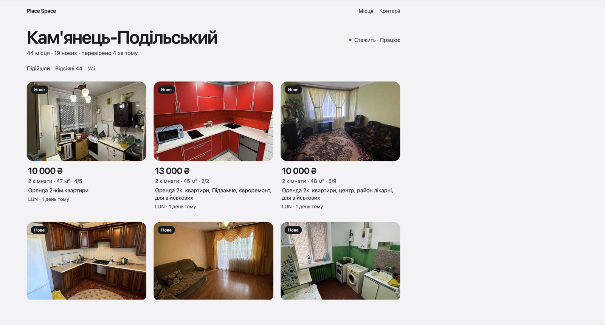
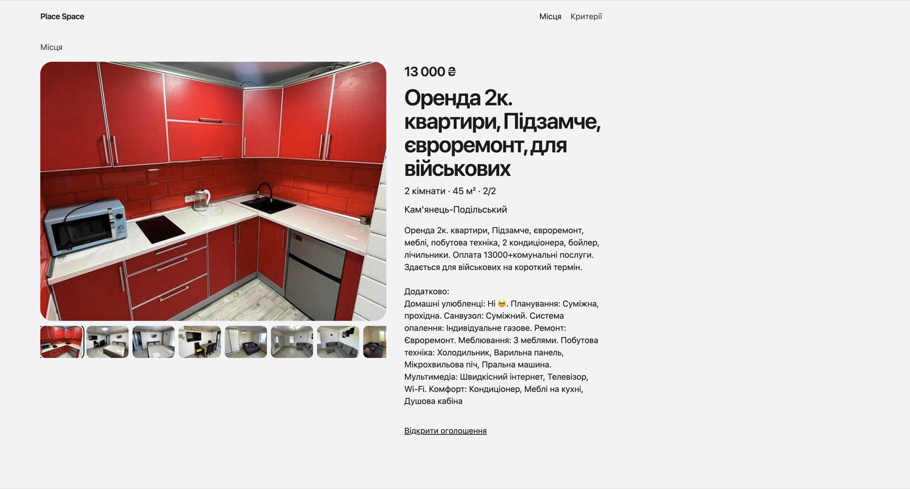
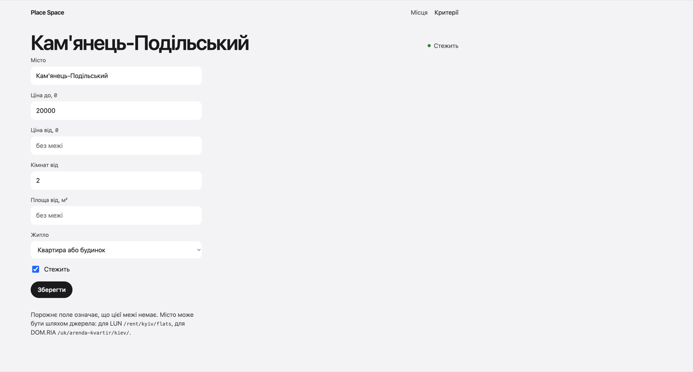

# Place Space

Локальний монітор оренди. Програма сама перечитує [LUN](https://lun.ua) і [DOM.RIA](https://dom.ria.com), залишає оголошення у ваших межах і позначає ті, що з’явилися за останню добу.

Сайт: [flat.eggs.gd](https://flat.eggs.gd). Його збирає SvelteKit і публікує GitHub Actions на кожен push у `main`, що чіпає `site/`.



Критерії задаються у вікні. Порожнє поле означає, що цієї межі немає. Мітка «Нове» стоїть на оголошенні, яке програма вперше побачила менше ніж добу тому серед тих, що підійшли.





## Запуск

Подвійний клік по зібраній програмі відкриває вікно і починає перевірку. На Windows це `place-space.exe`, на Mac — `Place Space.app` для Apple Silicon. База SQLite з’являється поруч із програмою, у папці `data`. На Mac ця папка лежить поруч із `.app`, не всередині нього. Журнал пишеться в `data/place-space.log`. Закриття вікна зупиняє перевірки.

Посилання «Відкрити оголошення» відкривається у звичайному браузері.

Збірку робить [GitHub Actions](.github/workflows/desktop.yml). Запуск workflow вручну кладе `place-space.exe` і `place-space-macos.zip` у вкладку Actions. Тег на кшталт `v0.1.0` публікує реліз. Mac-програма не підписана, тож перший запуск може вимагати правий клік і «Відкрити». На Windows потрібен WebView2, він уже є у Windows 10 і 11.

З вихідників вікно збирається так:

```bash
cd web && npm install && npm run build
go build -tags ui -o place-space ./cmd/placespace
./place-space
```

Для розробки інтерфейсу API лишається без вікна, а SvelteKit крутиться окремо:

```bash
go run ./cmd/placespace serve
```

```bash
cd web && npm install && npm run dev
```

Сторінка: http://localhost:5173. Поки вона відкрита, дані перечитуються кожні 30 секунд.

Пошук можна створити і з термінала. Команда одразу перевіряє джерела і записує результат у `data/place-space.db`:

```bash
go run ./cmd/placespace poll \
  --city "Кам'янець-Подільський" \
  --price-max 20000 \
  --rooms-min 2
```

Міста поза вбудованим списком передаються шляхом каталогу: для LUN `/rent/kyiv/flats`, для DOM.RIA `/uk/arenda-kvartir/kiev/`. Квартири й будинки разом: `--property apartment,house`.

`placespace run` перевіряє збережені пошуки без HTTP. `placespace status` друкує останній стан.

## Джерела

Підключені LUN і DOM.RIA. Публічного пошукового API в цих каталогів немає: картки вже лежать у HTML сторінки як JSON, тож адаптер читає їх напряму. Дошки, які не віддають каталог звичайним запитом, не підключені.

## Поведінка

- Інтервал береться з пошуку, типово 10 хвилин. Перша перевірка після запуску відбувається одразу.
- Однакове оголошення з двох різних адрес лишається двома картками. Збіг визначається за джерелом і зовнішнім id, а також за канонічним посиланням.
- Якщо межа вимагає ціну, кімнати чи площу, оголошення без цього поля її не проходить.
- Зникнення з чергової сторінки пошуку не видаляє картку.
- За одну перевірку читається щонайбільше 5 сторінок каталогу на кожен тип житла.
